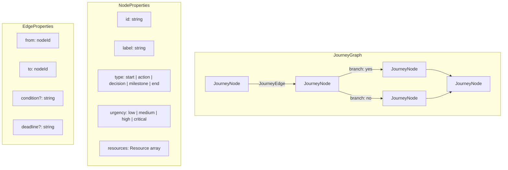
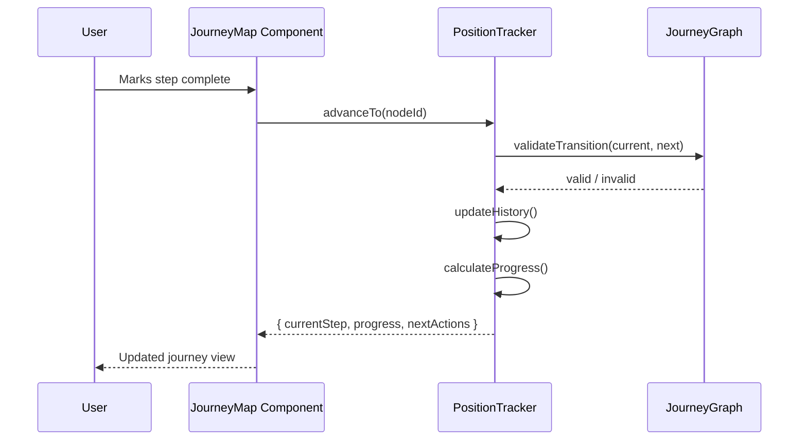
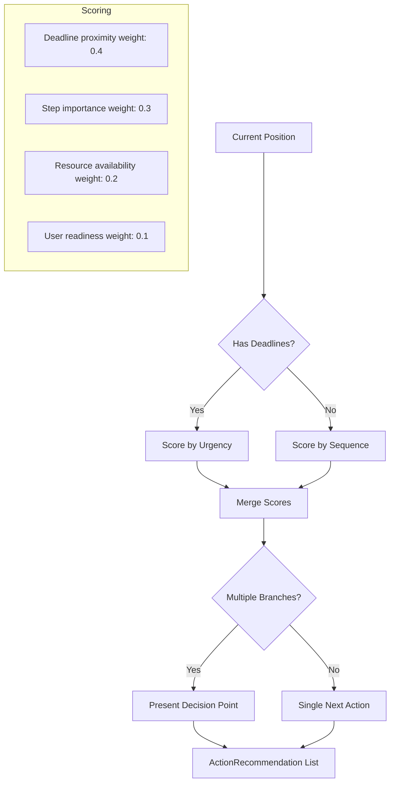
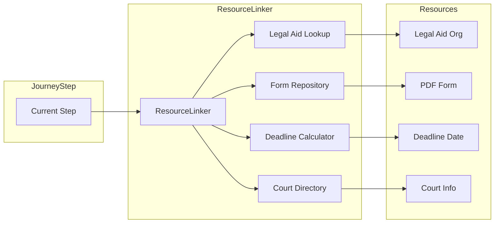

# Justice Navigator — Architecture

## Overview

Justice Navigator models legal processes as directed graphs where nodes represent steps and edges represent transitions. A position tracker follows the user through the graph, and a recommendation engine suggests next actions based on the current position, deadlines, and available resources.

---

## 1. Journey Graph Model

The journey graph is the core data structure. Each case type (eviction, custody, debt) is represented as a directed acyclic graph with branching paths based on user circumstances.

---

## 2. Position Tracking Flow

The position tracker maintains the user's location in the journey graph, their history of completed steps, and calculates progress percentage.

---

## 3. Recommendation Engine

The action recommender evaluates the user's current position, upcoming deadlines, and available branches to produce a prioritized list of next actions.

---

## 4. Resource Integration

The resource connector links each step in the journey to relevant external resources: legal aid organizations, downloadable forms, deadline calculators, and court information.

---

## Data Flow Summary

1. **User selects case type** -> loads the corresponding `JourneyGraph`
2. **Position tracker** initializes at the start node
3. **Journey map component** renders the graph with "you are here" indicator
4. **Action recommender** evaluates next steps and urgency
5. **Resource linker** attaches relevant resources to each recommended action
6. **Progress bar** updates as the user advances through the journey
