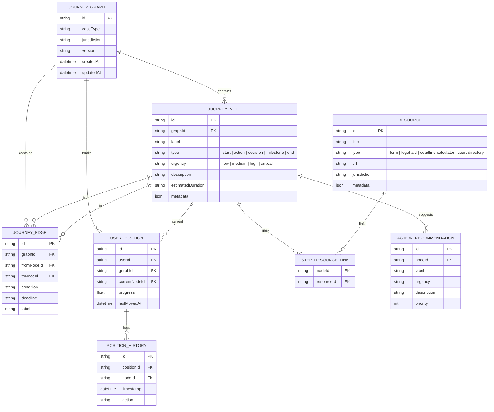

# Justice Navigator Data Model

## Entity Relationship Diagram

## Key Relationships

- A **Journey Graph** contains multiple **Nodes** and **Edges** forming a directed graph
- **Edges** connect nodes with optional conditions and deadlines for branching paths
- **User Position** tracks where a user currently is in a journey graph
- **Position History** logs every movement for audit and progress analysis
- **Resources** (forms, legal aid orgs, calculators) are linked to specific journey steps
- **Action Recommendations** are generated per-node based on urgency and context
